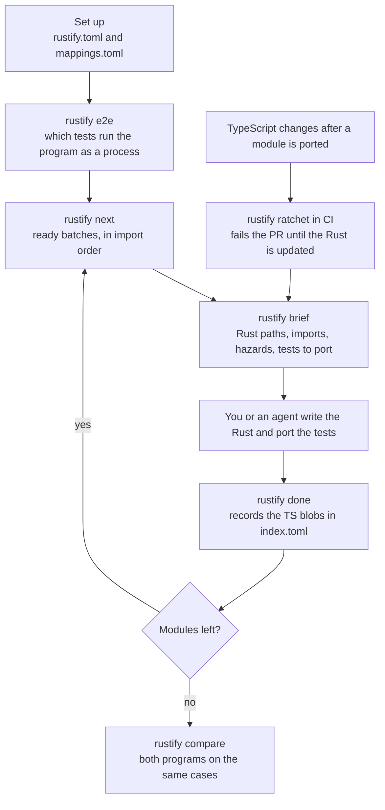

# rustify

`rustify` helps you port a TypeScript (or JavaScript) codebase to Rust one module at a time,
and keeps the port in step while the TypeScript keeps changing.

It reads your TypeScript import graph, tells you what to port next and how,
records what each TS file became in Rust, and fails CI when someone changes
ported TypeScript without porting the change.

It was built to port a ~1,200-file TypeScript CLI with coding agents working
in parallel. It works the same for a person porting by hand.



## What makes it different

1. **It ports a few files at a time, in import order.** A module is offered
   only after everything it imports is ported, so each batch compiles and its
   tests run before the next one starts. Import cycles are kept together as
   one batch. Nothing is reviewed only at the end.
2. **You decide how each construct is translated.** `mappings.toml` maps
   TypeScript constructs (as tree-sitter queries) and npm packages to the
   Rust you want, with the behavior differences to watch for. Every brief
   quotes the rules that match its files, so fifty agents make the same
   choice for `Promise.all`, regexes, or your HTTP client.
3. **It records what each Rust file was written against.** `index.toml` holds
   the git blob ids of the TypeScript file and its tests. That makes "is this
   module still current?" a comparison, not a judgement.
4. **CI keeps the port from falling behind.** While both codebases exist, a
   pull request that changes ported TypeScript fails until it carries the
   Rust change.
5. **It checks the result from outside.** `e2e` finds the tests that can run
   against either binary, and `compare` runs both programs on the same
   commands and diffs exit code, output, and files.

rustify writes no Rust itself. It plans, briefs, records, and checks.

## Contents

1. [Install](#install)
2. [Quickstart: port your first module](#quickstart-port-your-first-module)
3. [The porting loop](#the-porting-loop)
4. [Commands](#commands)
5. [Supporting more languages](#supporting-more-languages)
6. Further docs
   - [docs/workflow.md](docs/workflow.md): the full workflow, parallel agents,
     catch-up, CI, and what each error means
   - [docs/configuration.md](docs/configuration.md): every key in
     `rustify.toml`, `mappings.toml`, `components.toml`, `compare.toml`, and
     `index.toml`
   - [skills/rustify/SKILL.md](skills/rustify/SKILL.md): the same workflow
     as an agent skill

## Install

```bash
cargo install --locked --git https://github.com/ArchAstro/rustify
```

You need `git` on `PATH`. The TypeScript is parsed with tree-sitter, so it
needs no Node toolchain.

## Quickstart: port your first module

This walks through a tiny repository from scratch. Every command output below
was produced by running these steps.

### 0. The starting point

rustify works on a git repository and compares against an upstream branch
(`origin/main` by default), so you need commits and that ref.

```
packages/app/package.json                  {"name": "@acme/app"}
packages/app/src/slug.ts                   export function slugify(s: string): string { ... }
packages/app/src/store.ts                  imports ./slug and node:fs/promises
packages/app/src/__tests__/slug.test.ts    tests slugify
rust/app/Cargo.toml                        [package] name = "app", edition = "2024"
rust/app/src/lib.rs                        empty
.gitignore                                 target/
```

```bash
git init -b main && git add -A && git commit -m "TypeScript app"
# with a real remote, `git push -u origin main` creates origin/main.
# for a local experiment, point it at HEAD:
git update-ref refs/remotes/origin/main HEAD
```

### 1. Add `rustify.toml` at the repository root

Copy [`examples/typescript/rustify.toml`](examples/typescript/rustify.toml)
(it has a comment on every key) or write the minimum:

```toml
state_dir = "port"                    # where rustify keeps its files, relative to this file
roots = ["packages/app/src"]          # TS that must be ported
packages_dir = "packages"             # directory holding the package.json directories
primary_package = "@acme/app"         # its files land at the crate root
rust_crate = "rust/app"               # crate the Rust goes into
rust_crate_name = "app"
test_markers = ["/__tests__/", ".test.ts"]

[batch]
max_files = 6
max_lines = 800
```

### 2. Add the starter mappings

```bash
mkdir port
curl -fsSL https://raw.githubusercontent.com/ArchAstro/rustify/main/examples/typescript/mappings.toml -o port/mappings.toml
```

`mappings.toml` holds about 50 rules for TypeScript constructs (async
functions, `Promise.all`, regexes, classes, JSON, ...) and the common npm and
Node packages. Each rule gives the Rust equivalent and the behavior
differences to watch for. Every brief quotes the rules that match its files.
Edit it to fit your project; see [docs/configuration.md](docs/configuration.md).

### 3. Check what rustify found

```console
$ rustify status
Files            0 / 2     (0.0%)  in progress: 0
TS lines          0 / 8      (0.0%)
Units            0 / 2     ready now: 1
Module tests     0 / 1     (0.0%)

By package:
  @acme/app                                   0 / 2    files        8 lines
```

If the file count is wrong, fix `roots`, `exclude`, or `test_markers`.
`rustify check` warns about every npm package your code imports that has no
rule in `mappings.toml`; add one for each before porting the files that use it.

### 4. Ask what to port next

```console
$ rustify next
Batch 1 — 1 file(s), 1 lines, unblocks 1 (downstream 1), 1 test file(s)
  packages/app/src/slug.ts                                                   1 lines  → slug.rs
  test: packages/app/src/__tests__/slug.test.ts

`rustify next --brief` prints the porting brief for batch 1.
```

`store.ts` is not offered yet because it imports `slug.ts`. Modules are
always ported after the modules they import.

### 5. Read the brief

`rustify next --brief` (or `rustify brief <file>`) prints everything needed to
port the batch, as Markdown. Abridged:

```markdown
| TypeScript                 | Rust file (crate src/) | Module      |
|----------------------------|------------------------|-------------|
| `packages/app/src/slug.ts` | `slug.rs`              | `app::slug` |

Exports:
- `slugify` function → `app::slug::slugify`

TypeScript constructs → Rust:
- **regular expression** (lines 1): `regex::Regex` in a `std::sync::LazyLock`. ...
  - Hazard: JS `\s` differs from Rust's ...
- **String#trim / trimStart / trimEnd** (lines 1): a JS-exact `trim` helper ..., never `str::trim`.

## Tests to port with this batch
- `packages/app/src/__tests__/slug.test.ts` (1 lines)

## Workflow
1. `rustify start packages/app/src/slug.ts`
2. Port into the Rust files above, add the `mod` declarations, and port the tests.
3. `cargo test -p app` and `cargo clippy --workspace --all-targets -- -D warnings`.
4. `rustify done packages/app/src/slug.ts` (records the symbol map), then `rustify check`.
```

The brief is written so it can be handed to a coding agent as its prompt.
Run the `cargo` commands from the crate directory, or from a Cargo workspace
that contains it.

### 6. Claim, port, record

```console
$ rustify start packages/app/src/slug.ts
started packages/app/src/slug.ts
```

Write `rust/app/src/slug.rs`, add `pub mod slug;` to `lib.rs`, and port each
case of `slug.test.ts` as a Rust `#[test]` with the same name and assertions.
Then record it, naming the TS tests you ported:

```console
$ rustify done packages/app/src/slug.ts --test packages/app/src/__tests__/slug.test.ts
done packages/app/src/slug.ts

$ rustify check
1 indexed module(s), 0 error(s), 0 warning(s)
```

`done` writes this to `port/index.toml`:

```toml
[[module]]
ts = "packages/app/src/slug.ts"
status = "ported"
rust = "slug.rs"
module = "app::slug"
ported_at = "2026-10-06T21:06:42Z"
ts_base = "27f904fccdd700cb734b50d0b65ab9e190ece50b"
tests = ["packages/app/src/__tests__/slug.test.ts"]

[module.ts_blobs]
"packages/app/src/__tests__/slug.test.ts" = "445d2a09115948c6c7e2f4567a8b7c506e1b8678"
"packages/app/src/slug.ts" = "161621a1ff7ac3b694cd820f9fd9c63b8eb8cf84"

[module.symbols]
slugify = "app::slug::slugify"
```

`ts_blobs` are the git blob ids of the exact TS the Rust was written against.
If you forget `--test`, run `done` again with it: `done` can be re-run any
time and keeps what it recorded before.

Commit `rustify.toml`, `port/`, and the Rust together. Then `rustify next`
offers `store.ts`. Its brief maps `node:fs/promises` to `tokio::fs` and says
there are no TS tests for it, so you write Rust unit tests for its exports.

### 7. Turn on the CI gate

Copy [`examples/ci/rustify-ratchet.yml`](examples/ci/rustify-ratchet.yml) to
`.github/workflows/` (setup steps are in
[docs/workflow.md](docs/workflow.md#7-the-ci-ratchet)). A branch that changes
nothing ported passes:

```console
$ rustify ratchet
OK: no ported module became stale since 27f904fccdd7 (0 stale at the merge base, 0 at HEAD; the count may only shrink).
```

A branch that edits `slug.ts` without updating the Rust fails with exit code 1:

```console
$ rustify ratchet
error: packages/app/src/slug.ts is a ported module whose TypeScript this branch changed without porting it
  changed: packages/app/src/slug.ts
  rust:    rust/app/src/slug.rs
  fix:     port the change into rust/app/src/slug.rs and its tests, then run `rustify done packages/app/src/slug.ts`
1 module(s) became stale, 0 entry(ies) dropped, and 0 new unported import(s). Port each change into Rust and run `rustify done` in this PR.
```

## The porting loop

```
rustify next --brief      pick a batch, read the brief
rustify start <files>     claim it
  ...write Rust + tests...
cargo test / clippy
rustify done <files> --test <ts tests>
rustify check             index, graph, and Rust agree
commit
```

When the TypeScript moves on after you ported something:

```
git fetch origin main
rustify drift             which ported modules changed upstream, with the git diff command
rustify next --catch-up   re-port them in dependency order
rustify done <file>       re-records the new TS as ported
```

Before the first batch, and after the last:

```
rustify e2e               which tests run the program as a process without importing its source
rustify compare           run the cases in compare.toml through both programs and diff the results
```

[docs/workflow.md](docs/workflow.md) covers each step in detail. To have a
coding agent run the port, give it [skills/rustify/SKILL.md](skills/rustify/SKILL.md).

## Commands

All commands accept `--json` where it makes sense, `--repo <dir>` to start
from another directory, and `--config <path>` (or `RUSTIFY_CONFIG`) to use a
`rustify.toml` that is not in the current directory or a parent.

| Command | Use it to |
|---|---|
| `status` | See files, lines, units, and tests ported, by package |
| `next` | Get the next batches. `--brief` prints the first brief; `--count N`; `--package NAME`; `--independent` for batches that can be ported in parallel; `--catch-up` for upstream changes only; `--write-briefs DIR` writes one brief per batch |
| `brief <ts>...` | Get the brief for specific files |
| `start <ts>...` | Claim files. Refuses if a dependency is not ported (`--force` overrides) |
| `done <ts>...` | Record a port. `--test T` per ported TS test; `--map tsName=rust::path` for renamed exports (`tsName=-` for none); `--rust FILE` when the Rust file is not the default path; `--notes`; `--verified` |
| `skip <ts>... --reason R` | Mark files not needed in Rust (build glue, entrypoint shims) |
| `replace <ts>... --with X` | Mark files provided by a crate or std instead (`--with tokio::process`) |
| `find <name>` | Find a name across TS exports, the index, Rust items, and mappings |
| `check` | Verify the index, graph, and Rust crates agree. Exits 1 on errors |
| `drift` | List ported modules whose TS or tests changed on the upstream ref |
| `ratchet` | CI gate. `--base REF` (default: the upstream ref) |
| `graph` | Graph summary and rule hit counts; `--json` for the full graph |
| `e2e` | List the tests that run the program as a process, split by whether they also import its source. Run before porting |
| `compare` | Run each case in `compare.toml` through the TypeScript and Rust programs and report differences in exit code, stdout, stderr, and files. `--case NAME`; `--keep DIR`. Exits 1 on a difference that is not accepted |
| `stamp-blobs` | Backfill `ts_blobs` on index entries written before blobs existed |

## Supporting more languages

rustify reads TypeScript and JavaScript and targets Rust. Nothing else is
supported today. The planning, provenance, ratchet, and `compare` code does
not depend on either language; these parts do:

| To change | Where | What it does now |
|---|---|---|
| Source language | `src/analyze.rs` | Parses with `tree-sitter-typescript` and collects imports, exports, and construct matches |
| Import resolution | `src/packages.rs`, `src/graph.rs` | Resolves relative imports, `package.json` `exports`, workspace links, and Node builtins |
| Translation rules | `mappings.toml` | Tree-sitter queries written against the TypeScript grammar |
| Target language | `src/rust_items.rs`, `rust_target` in `src/graph.rs` | Finds Rust items with `tree-sitter-rust` and mirrors a TS path to a `.rs` file and module path |
| Test detection | `src/e2e.rs`, `test_markers` | Knows Node, Bun, and Deno ways of starting a process |

A new source language needs a tree-sitter grammar, an import collector for
it, a resolver for its module system, and a `mappings.toml` written against
its grammar. A new target needs an item scanner and a path-mirroring rule.
`compare` already works for any pair of programs: it only runs commands.

If you add one, open an issue first so the config keys can be agreed
(`extensions` already selects which files are sources).

## Development

```bash
cargo test
cargo clippy --all-targets -- -D warnings
cargo fmt --check
```

`tests/porting_workflow.rs` drives the real binary through a full port of a
small fixture monorepo in a temporary git repository.

## License

MIT
